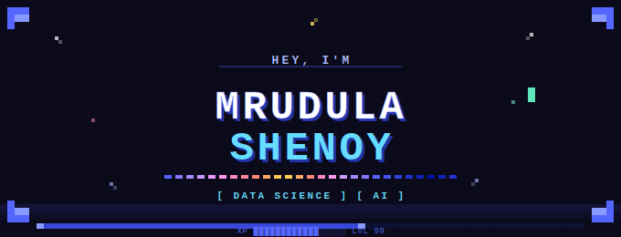

 

 

---
## ✦ About Me

I'm **Mrudula Shenoy**, a final-year **B.Tech Data Science student from Mumbai, India**, with hands-on experience in **machine learning, NLP, computer vision, and cloud infrastructure**.

I enjoy building projects that go beyond coursework — from a **gamified AI-driven coding escape room** to **predictive machine learning models** and a **conversational AI portfolio chatbot**.

I hold **Oracle Cloud Infrastructure Foundations Associate** and **Oracle Cloud Infrastructure AI Foundations** certifications, and I'm currently applying to the **MSc in Artificial Intelligence at USI, Switzerland**.

What drives me most is the gap between *what I can build* and *what I truly understand* — and I'm always trying to close that gap.

---
## ✦ Projects

| Project | What It Does | Stack |
|---------|-------------|-------|
| [🎮 Coding Carnival](https://github.com/STarryLuna-pixel/coding-carnival) | A multi-language gamified escape room that teaches coding and analytical thinking through themed challenges, storytelling, and interactive progression | Python · JavaScript · HTML/CSS · AI |
| [🏏 Predictive Analysis in Cricket](https://github.com/StarryLuna-pixel/Predictive-Analysis-in-Cricket) | Machine learning-based cricket outcome analysis with predictive insights and data-driven strategy exploration | Python · Scikit-learn · Tableau |
| [🪄 Wand_AI] (https://github.com/StarryLuna-pixel/Wand_AI-) | Real-time wand gesture recognition using HSV colour segmentation and trajectory normalisation — classifies 12 Harry Potter spells and maps them to OS-level actions via a full ML pipeline | Python · OpenCV · Scikit-learn · Random Forest · Flask |

---
## ✦ Certifications

- 🏅 Oracle Cloud Infrastructure Foundations Associate
- 🏅 Oracle Cloud Infrastructure AI Foundations

---
## ✦ Research

📄 Co-authored paper published in **IJRASET**  
**Coding Carnival: AI-Driven Gamified Escape Room**  
🔗 DOI: [https://doi.org/10.22214/ijraset.2026.79263](https://doi.org/10.22214/ijraset.2026.79263)

---
## ✦ Interests

- Data Analytics & Visualization
- Artificial Intelligence & Machine Learning
- Natural Language Processing
- Computer Vision
- Intelligent Interactive Systems
- Gamification, and educational technology

---

*Mumbai, India · Open to internships, entry-level roles, and project collaborations*
 

 

